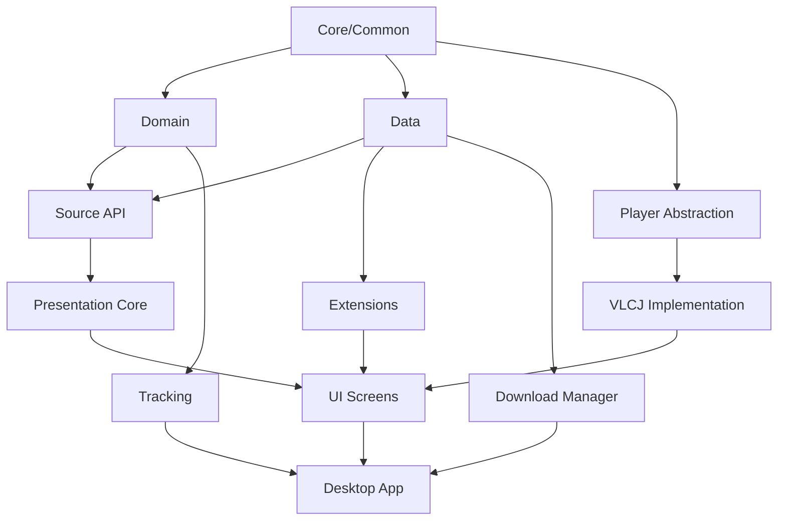

# Anikku Windows Port - Multi-Session Migration Plan

## Project Overview

**Anikku** is a full-featured anime player and library manager currently built for Android. This document outlines the strategy for porting it to Windows using Kotlin Multiplatform and Compose Desktop across multiple development sessions.

### Current Tech Stack (Android)
- **Language**: Kotlin
- **UI**: Jetpack Compose
- **Database**: SQLDelight
- **Video Player**: mpv-android (native library)
- **Build System**: Gradle (multi-module)
- **Architecture**: Clean Architecture (Domain, Data, Presentation layers)
- **Key Libraries**: OkHttp, Coil, RxJava, Voyager navigation

### Target Tech Stack (Windows)
- **Language**: Kotlin/JVM
- **UI**: Compose Multiplatform Desktop
- **Database**: SQLDelight (cross-platform)
- **Video Player**: libmpv (JNI/JNA) or VLCJ
- **Build System**: Gradle with Kotlin Multiplatform
- **Distribution**: JPackage or Compose Desktop packaging

---

## Session Structure (8-12 Sessions)

Each session is designed to fit within the 200K token context window limit.

---

### **Session 1: Foundation & Strategy** ✓ CURRENT

**Goal**: Analyze codebase, create migration strategy, setup initial Windows project structure

**Duration**: 1 session

**Tasks**:
- [x] Analyze current Android architecture
- [x] Identify platform-specific vs. shared code
- [ ] Create technology decision document
- [ ] Setup initial Kotlin Multiplatform structure
- [ ] Create desktop module skeleton
- [ ] Configure build.gradle.kts for multiplatform
- [ ] Setup version catalogs for desktop dependencies

**Key Decisions**:
1. **Video Player**: libmpv with JNA bindings vs VLCJ
   - Recommendation: VLCJ (better Java integration, active maintenance)
2. **UI Framework**: Compose Multiplatform Desktop (confirmed)
3. **Navigation**: Voyager supports multiplatform (keep)
4. **DI**: Migrate from Injekt to Koin (better KMP support)

**Deliverables**:
- Technology decision document
- Project structure blueprint (`desktop/` module)
- Updated `settings.gradle.kts` with desktop target
- Module migration priority list

**Files to Modify**:
- `settings.gradle.kts`
- `build.gradle.kts` (root)
- Create: `desktop/build.gradle.kts`
- Create: `TECHNOLOGY_DECISIONS.md`
- Create: `docs/ARCHITECTURE_WINDOWS.md`

---

### **Session 2: Core Infrastructure & Build System**

**Goal**: Setup Kotlin Multiplatform project structure for shared modules

**Duration**: 1 session

**Tasks**:
- [ ] Convert `core/common` to Kotlin Multiplatform
- [ ] Create `commonMain`, `androidMain`, `desktopMain` source sets
- [ ] Setup SQLDelight for desktop target
- [ ] Configure Compose Desktop dependencies
- [ ] Setup Koin for dependency injection
- [ ] Create platform-specific abstractions

**Focus Modules**:
- `core/common/` → KMP
- `core/archive/` → File handling abstraction
- `buildSrc/` → Add KMP configuration scripts

**Platform Abstractions Needed**:
```kotlin
// Expected classes to create
expect class PlatformContext
expect class FileManager
expect fun getPlatformName(): String
expect class ImageLoader
expect class VideoPlayerFactory
```

**Deliverables**:
- KMP-enabled core modules
- Platform abstraction interfaces
- Desktop implementations stub
- Working desktop build configuration

**Files to Create/Modify**:
- `core/common/build.gradle.kts` → Add KMP plugin
- `core/common/src/commonMain/kotlin/`
- `core/common/src/desktopMain/kotlin/`
- `buildSrc/src/main/kotlin/mihon.library.multiplatform.gradle.kts`

---

### **Session 3: Domain Layer Migration**

**Goal**: Make domain logic platform-agnostic

**Duration**: 1 session

**Tasks**:
- [ ] Migrate `domain/` module to KMP
- [ ] Extract Android-specific code to `androidMain`
- [ ] Create `desktopMain` implementations
- [ ] Port all use cases (interactors)
- [ ] Update repository interfaces
- [ ] Migrate domain models to be platform-independent

**Focus Modules**:
- `domain/` → Full KMP conversion
- `core-metadata/` → Metadata handling

**Key Challenges**:
- Remove `android.net.Uri` usage → Use custom URI abstraction
- Remove `android.content.Context` dependencies
- Platform-agnostic file paths

**Deliverables**:
- Platform-agnostic domain layer
- Repository interfaces for desktop
- Use cases working on both platforms

**Files to Modify**:
- `domain/build.gradle.kts`
- `domain/src/main/java/` → Restructure to KMP source sets
- All domain models in `domain/src/main/java/tachiyomi/domain/`

---

### **Session 4: Data Layer & Database**

**Goal**: Port data persistence layer to work on Windows

**Duration**: 1 session

**Tasks**:
- [ ] Configure SQLDelight for desktop driver
- [ ] Create Windows file system abstractions
- [ ] Port backup/restore logic for Windows paths
- [ ] Implement desktop cache management
- [ ] Setup OkHttp for desktop (already cross-platform)
- [ ] Create Windows-specific storage preferences

**Focus Modules**:
- `data/`
- `data/src/main/sqldelight/`

**Platform-Specific Implementations**:
```kotlin
// Desktop file system
class DesktopFileManager : FileManager {
    override fun getAppDataDir(): Path
    override fun getCacheDir(): Path
    override fun getDownloadsDir(): Path
}
```

**SQLDelight Configuration**:
```kotlin
// Desktop driver setup
val driver = JdbcSqliteDriver(
    url = "jdbc:sqlite:${appDataDir}/anikku.db"
)
```

**Deliverables**:
- SQLDelight working on desktop
- File system abstraction for Windows
- Network layer functional
- Cache system operational

**Files to Modify**:
- `data/build.gradle.kts` → Add desktop SQLDelight driver
- `data/src/main/java/tachiyomi/data/` → Restructure to KMP
- Create: `data/src/desktopMain/kotlin/`

---

### **Session 5: Source API & Extension System**

**Goal**: Port the extension/plugin system to Windows

**Duration**: 1 session

**Tasks**:
- [ ] Adapt `source-api/` for desktop (already mostly KMP)
- [ ] Create Windows extension loader (replace APK loading with JAR)
- [ ] Port HTTP sources
- [ ] Adapt video extraction logic
- [ ] Create extension repository for desktop
- [ ] Port extension preferences UI

**Focus Modules**:
- `source-api/` (already KMP, needs desktop adaptations)
- `source-local/`
- `app/src/main/java/eu/kanade/tachiyomi/extension/`

**Extension Loading Strategy**:
```kotlin
// Replace Android APK loading with JAR loading
class DesktopExtensionLoader {
    fun loadExtension(jarFile: File): Extension {
        val classLoader = URLClassLoader(arrayOf(jarFile.toURI().toURL()))
        // Load extension classes
    }
}
```

**Deliverables**:
- Desktop extension loader
- JAR-based extension format
- Extension repository UI for desktop
- Sample extension ported to desktop

**Files to Create/Modify**:
- `source-api/src/desktopMain/kotlin/`
- Create: `desktop/extension-loader/`
- `app/src/main/java/eu/kanade/tachiyomi/extension/` → Platform abstractions

---

### **Session 6: Video Player Integration** ⚠️ CRITICAL

**Goal**: Implement video playback for Windows

**Duration**: 1-2 sessions (complex)

**Tasks**:
- [ ] Integrate VLCJ (or libmpv via JNA)
- [ ] Create `VideoPlayer` interface abstraction
- [ ] Port player preferences
- [ ] Implement video renderer in Compose Desktop
- [ ] Subtitle support
- [ ] Audio/video track selection
- [ ] Playback controls
- [ ] Implement floating window (PiP alternative)

**Technology Choice**: **VLCJ** (VLC Java bindings)
```gradle
implementation("uk.co.caprica:vlcj:4.8.2")
implementation("uk.co.caprica:vlcj-natives:4.8.0")
```

**Player Architecture**:
```kotlin
interface VideoPlayer {
    fun play(url: String)
    fun pause()
    fun seek(position: Long)
    fun setSubtitle(track: Int)
    fun setAudioTrack(track: Int)
}

class VLCJPlayer : VideoPlayer {
    private val mediaPlayerFactory = MediaPlayerFactory()
    private val mediaPlayer = mediaPlayerFactory.mediaPlayers().newEmbeddedMediaPlayer()
    // Implementation
}
```

**Compose Integration**:
```kotlin
@Composable
fun VideoPlayerView(player: VideoPlayer) {
    // Use Swing interop for VLCJ surface
    SwingPanel(
        factory = {
            val surface = CallbackMediaPlayerComponent()
            player.setSurface(surface.videoSurface())
            surface
        }
    )
}
```

**Deliverables**:
- Working video player on Windows
- Player controls UI in Compose
- Subtitle rendering
- Audio/video track switching
- Picture-in-Picture alternative (floating window)

**Files to Create**:
- `desktop/player/`
- `desktop/player/VLCJPlayer.kt`
- `desktop/player/VideoPlayerView.kt`
- Port: `app/src/main/java/eu/kanade/tachiyomi/ui/player/` → Desktop versions

---

### **Session 7: Compose Desktop UI - Core Screens (Part 1)**

**Goal**: Port library, browse, and updates screens

**Duration**: 1 session

**Tasks**:
- [ ] Port base Compose components to desktop
- [ ] Adapt Material3 components for desktop
- [ ] Port Library screen
- [ ] Port Browse/Extensions screen
- [ ] Port Updates screen
- [ ] Create desktop navigation structure
- [ ] Handle desktop window management

**Focus Modules**:
- `presentation-core/`
- `app/src/main/java/eu/kanade/presentation/library/`
- `app/src/main/java/eu/kanade/presentation/browse/`
- `app/src/main/java/eu/kanade/presentation/updates/`

**Desktop UI Adaptations**:
- Replace Android `Scaffold` with Desktop window chrome
- Adapt `LazyColumn`/`LazyGrid` for desktop scrolling
- Desktop-specific context menus (right-click)
- Keyboard navigation support

**Navigation Structure**:
```kotlin
// Desktop navigation with Voyager
@Composable
fun DesktopApp() {
    Navigator(HomeScreen()) { navigator ->
        DesktopScaffold(navigator) {
            CurrentScreen()
        }
    }
}
```

**Deliverables**:
- Library screen functional on desktop
- Browse screen with extension listing
- Updates screen with episode updates
- Desktop navigation working
- Desktop-specific UI patterns implemented

**Files to Port**:
- `app/src/main/java/eu/kanade/presentation/library/` → `desktop/src/main/kotlin/presentation/library/`
- `presentation-core/` → Add desktop source set

---

### **Session 8: Compose Desktop UI - Core Screens (Part 2)**

**Goal**: Port anime detail, settings, and history screens

**Duration**: 1 session

**Tasks**:
- [ ] Port Anime detail screen
- [ ] Port Settings screens (all preference screens)
- [ ] Port History screen
- [ ] Implement desktop dialogs
- [ ] Create Windows system tray integration
- [ ] Port theme system

**Focus Files**:
- `app/src/main/java/eu/kanade/presentation/anime/`
- `app/src/main/java/eu/kanade/presentation/more/settings/`
- `app/src/main/java/eu/kanade/presentation/history/`

**Desktop-Specific Features**:
```kotlin
// System tray integration
class DesktopSystemTray {
    fun show() {
        val tray = SystemTray.getSystemTray()
        val image = Toolkit.getDefaultToolkit().getImage("icon.png")
        val trayIcon = TrayIcon(image, "Anikku")
        // Add menu items
    }
}
```

**Deliverables**:
- Anime detail screen with episode list
- Complete settings UI
- History tracking working
- System tray icon and menu
- Desktop dialogs (file picker, confirmations)

**Files to Port**:
- `app/src/main/java/eu/kanade/presentation/anime/` → Desktop version
- `app/src/main/java/eu/kanade/presentation/more/` → Desktop version

---

### **Session 9: Download Manager & File System**

**Goal**: Port download and storage management to Windows

**Duration**: 1 session

**Tasks**:
- [ ] Create desktop download manager
- [ ] Port file organization logic
- [ ] Implement Windows notifications (toast)
- [ ] Background download service
- [ ] Port cover cache system
- [ ] Create download queue UI

**Focus Files**:
- `app/src/main/java/eu/kanade/tachiyomi/data/download/`
- `app/src/main/java/eu/kanade/tachiyomi/data/cache/`
- `app/src/main/java/eu/kanade/tachiyomi/data/notification/`

**Windows Notifications**:
```kotlin
// Windows Toast Notifications
class WindowsNotificationManager {
    fun showDownloadComplete(title: String) {
        // Use Windows 10/11 Toast API via JNA
        // Or use external library like jpowershell
    }
}
```

**Desktop Download Manager**:
```kotlin
class DesktopDownloadManager {
    private val downloadQueue = mutableListOf<Download>()
    
    suspend fun queueDownload(episode: Episode) {
        // Download using coroutines
        downloadQueue.add(Download(episode))
        processQueue()
    }
}
```

**Deliverables**:
- Functional download system
- Windows notifications for downloads
- Download queue management
- Cover image caching
- Storage management UI

**Files to Create/Modify**:
- Create: `desktop/download/DesktopDownloadManager.kt`
- Create: `desktop/notifications/WindowsNotifications.kt`
- Port: `app/src/main/java/eu/kanade/tachiyomi/data/download/`

---

### **Session 10: Tracking & Sync Services**

**Goal**: Port online service integrations (MAL, AniList, etc.)

**Duration**: 1 session

**Tasks**:
- [ ] Port tracking services (MAL, AniList, Kitsu, etc.)
- [ ] Implement desktop OAuth flow (browser-based)
- [ ] Port sync services (Google Drive, SyncYomi)
- [ ] Adapt backup/restore for Windows paths
- [ ] Port Discord RPC integration
- [ ] Create account management UI

**Focus Files**:
- `app/src/main/java/eu/kanade/tachiyomi/data/track/`
- `app/src/main/java/eu/kanade/tachiyomi/data/sync/`
- `app/src/main/java/eu/kanade/tachiyomi/data/connections/`

**Desktop OAuth Flow**:
```kotlin
class DesktopOAuthHandler {
    fun startOAuthFlow(authUrl: String): String {
        // Open system browser
        Desktop.getDesktop().browse(URI(authUrl))
        
        // Start local callback server
        val server = HttpServer.create(InetSocketAddress(8080), 0)
        server.createContext("/callback") { exchange ->
            val code = extractCode(exchange.requestURI)
            // Handle OAuth code
        }
        server.start()
    }
}
```

**Deliverables**:
- All tracking services working
- OAuth login via system browser
- Google Drive sync operational
- Discord Rich Presence on Windows
- Backup/restore for Windows

**Files to Port**:
- `app/src/main/java/eu/kanade/tachiyomi/data/track/` → Desktop adaptations
- `app/src/main/java/eu/kanade/tachiyomi/data/sync/` → Windows paths

---

### **Session 11: Windows-Specific Features & Polish**

**Goal**: Add Windows platform integration and polish

**Duration**: 1 session

**Tasks**:
- [ ] Windows installer (MSI/EXE via JPackage)
- [ ] Auto-updater for Windows
- [ ] File associations (.mkv, .mp4, etc.)
- [ ] Windows taskbar integration (progress, jump lists)
- [ ] Windows theme integration (dark/light mode)
- [ ] Keyboard shortcuts and accessibility
- [ ] Performance optimization
- [ ] Memory management

**Windows Integration**:
```kotlin
// File associations
// In installer script (Inno Setup or WiX)
[Registry]
Root: HKCR; Subkey: ".mkv"; ValueType: string; ValueData: "AnikkuVideo"
Root: HKCR; Subkey: "AnikkuVideo\shell\open\command"; ValueType: string; ValueData: "{app}\Anikku.exe ""%1"""

// Taskbar progress
class WindowsTaskbarIntegration {
    fun setProgress(progress: Int) {
        // Use JNA to call Windows API
        val taskbar = Taskbar.getTaskbar()
        taskbar.setWindowProgressValue(window, progress)
    }
}
```

**JPackage Configuration**:
```kotlin
tasks.register("packageWindows") {
    doLast {
        exec {
            commandLine(
                "jpackage",
                "--input", "build/libs",
                "--name", "Anikku",
                "--main-jar", "anikku-desktop.jar",
                "--type", "msi",
                "--win-dir-chooser",
                "--win-menu",
                "--win-shortcut"
            )
        }
    }
}
```

**Deliverables**:
- Windows installer (MSI)
- Auto-update mechanism
- File type associations
- Taskbar integration
- System theme support
- Optimized performance

**Files to Create**:
- `desktop/installer/windows/` → Installer scripts
- `desktop/updater/WindowsUpdater.kt`
- `desktop/integration/WindowsIntegration.kt`

---

### **Session 12: Testing, Documentation & Final Polish**

**Goal**: Ensure stability, performance, and usability

**Duration**: 1 session

**Tasks**:
- [ ] Port unit tests to KMP
- [ ] Create desktop integration tests
- [ ] Performance profiling and optimization
- [ ] Memory leak detection and fixes
- [ ] Create Windows build documentation
- [ ] Write user guide for Windows
- [ ] Create troubleshooting guide
- [ ] Final bug fixes and polish

**Testing Strategy**:
```kotlin
// Common tests
class AnimeRepositoryTest {
    @Test
    fun `test anime retrieval`() = runTest {
        // Test works on both Android and Desktop
    }
}

// Desktop-specific tests
class DesktopPlayerTest {
    @Test
    fun `test VLCJ player initialization`() {
        val player = VLCJPlayer()
        assertTrue(player.isInitialized())
    }
}
```

**Documentation to Create**:
- `docs/BUILD_WINDOWS.md` - Build instructions
- `docs/DEVELOPMENT_WINDOWS.md` - Developer guide
- `docs/USER_GUIDE_WINDOWS.md` - End-user documentation
- `docs/TROUBLESHOOTING_WINDOWS.md` - Common issues

**Deliverables**:
- Test suite passing on Windows
- Performance benchmarks
- Complete documentation
- Release-ready Windows build

---

## Key Challenges & Solutions

| Challenge | Android Approach | Windows Solution |
|-----------|------------------|------------------|
| **Video Playback** | mpv-android (native library) | VLCJ or libmpv via JNA |
| **File Access** | Storage Access Framework (SAF) | `java.nio.file` + native file picker |
| **Notifications** | Android NotificationManager | Windows Toast Notifications (JNA) |
| **Background Tasks** | WorkManager | Kotlin Coroutines + Windows Task Scheduler |
| **Extensions** | APK loading via PackageManager | JAR loading via URLClassLoader |
| **System Integration** | Android Intents | Windows Shell API (JNA) |
| **PiP Mode** | Android Picture-in-Picture | Floating window (Compose Desktop) |
| **Cast Support** | Google Cast SDK | DLNA/UPnP or remove feature |
| **Permissions** | Android runtime permissions | Windows UAC + registry |
| **Deep Links** | Android Intent Filters | Windows protocol handlers |

---

## Module Migration Priority (Dependency Order)



**Order**:
1. ✅ **core/common/** → Platform-agnostic utilities
2. **domain/** → Business logic (no Android deps)
3. **data/** → Persistence (SQLDelight + File I/O)
4. **source-api/** → Already mostly KMP
5. **presentation-core/** → Shared UI components
6. **player/** → Video playback abstraction + VLCJ
7. **extensions/** → JAR-based plugin system
8. **ui/** → Compose Desktop screens
9. **tracking/** → Online services
10. **downloads/** → Download management
11. **desktop-app/** → Main application assembly
12. **windows-integration/** → Platform-specific features

---

## Dependencies & Version Catalogs

### Desktop Dependencies to Add

```toml
# gradle/desktop.versions.toml (create this file)
[versions]
vlcj = "4.8.2"
jna = "5.14.0"
compose-desktop = "1.6.0"
koin = "3.5.3"
ktor-client = "2.3.7"

[libraries]
# Video Player
vlcj = { module = "uk.co.caprica:vlcj", version.ref = "vlcj" }
vlcj-natives-windows = { module = "uk.co.caprica:vlcj-natives", version = "4.8.0", classifier = "windows-x64" }

# JNA for native calls
jna = { module = "net.java.dev.jna:jna", version.ref = "jna" }
jna-platform = { module = "net.java.dev.jna:jna-platform", version.ref = "jna" }

# Compose Desktop
compose-desktop = { module = "org.jetbrains.compose.desktop:desktop-jvm", version.ref = "compose-desktop" }

# Dependency Injection
koin-core = { module = "io.insert-koin:koin-core", version.ref = "koin" }
koin-compose = { module = "io.insert-koin:koin-compose", version.ref = "koin" }

# SQLDelight Desktop
sqldelight-driver-sqlite = { module = "app.cash.sqldelight:sqlite-driver", version = "2.1.0" }

# HTTP Client (cross-platform alternative to OkHttp)
ktor-client-core = { module = "io.ktor:ktor-client-core", version.ref = "ktor-client" }
ktor-client-cio = { module = "io.ktor:ktor-client-cio", version.ref = "ktor-client" }

# File System
commons-io = "commons-io:commons-io:2.15.1"

# Windows Notifications
jpowershell = "com.profesorfalken:jPowerShell:3.1.1"

[bundles]
vlcj = ["vlcj", "vlcj-natives-windows"]
jna = ["jna", "jna-platform"]
koin = ["koin-core", "koin-compose"]
ktor-client = ["ktor-client-core", "ktor-client-cio"]
```

---

## Session Transition Protocol

### Between Sessions - Save State

Create a JSON/Markdown handoff document:

```markdown
## Session N → Session N+1 Handoff

### Completed
- [x] Module X migrated to KMP
- [x] Feature Y implemented
- [x] Tests passing for Z

### In Progress
- [ ] Feature A (60% complete)
  - Files: `path/to/file.kt`
  - Blockers: Need to resolve dependency issue
  
### Blockers
- Issue with VLCJ initialization on Windows 11
- SQLDelight migration queries need verification

### Next Session Priorities
1. Complete Feature A
2. Start Module B migration
3. Fix blocker issues

### Key Files Modified
- `desktop/build.gradle.kts`
- `core/common/src/desktopMain/kotlin/Platform.kt`
- `data/src/desktopMain/kotlin/DesktopFileManager.kt`

### Technical Decisions Made
- Chose VLCJ over libmpv (reason: better Java integration)
- Using Koin instead of Injekt (reason: KMP support)

### Notes
- Remember to test on both Windows 10 and 11
- Keep Android build working during migration
```

---

## Project Structure (After Migration)

```
anikku/
├── android/                    # Android-specific code
│   └── src/main/
├── desktop/                    # Desktop-specific code (NEW)
│   ├── src/main/kotlin/
│   │   ├── Main.kt
│   │   ├── player/
│   │   │   ├── VLCJPlayer.kt
│   │   │   └── VideoPlayerView.kt
│   │   ├── integration/
│   │   │   └── WindowsIntegration.kt
│   │   └── ui/
│   ├── installer/
│   │   └── windows/
│   └── build.gradle.kts
├── core/
│   ├── common/                 # Shared (KMP)
│   │   ├── src/
│   │   │   ├── commonMain/
│   │   │   ├── androidMain/
│   │   │   └── desktopMain/
│   │   └── build.gradle.kts
│   └── archive/
├── domain/                     # Shared (KMP)
│   ├── src/
│   │   ├── commonMain/
│   │   ├── androidMain/
│   │   └── desktopMain/
│   └── build.gradle.kts
├── data/                       # Shared (KMP)
│   ├── src/
│   │   ├── commonMain/
│   │   │   └── sqldelight/
│   │   ├── androidMain/
│   │   └── desktopMain/
│   └── build.gradle.kts
├── source-api/                 # Already KMP
├── presentation-core/          # Shared UI (KMP)
├── i18n/                       # Localization
└── gradle/
    ├── libs.versions.toml
    ├── desktop.versions.toml   # NEW
    └── ...
```

---

## Success Metrics

### Per Session
- [ ] All modified modules compile successfully
- [ ] Existing Android build still works
- [ ] New desktop functionality tested manually
- [ ] Documentation updated

### Overall Project
- [ ] Desktop app launches and shows UI
- [ ] Video playback works on Windows
- [ ] Library management functional
- [ ] Extensions can be loaded
- [ ] Settings persist across launches
- [ ] Performance acceptable (60 FPS UI, smooth video)
- [ ] Installer works on Windows 10/11
- [ ] File size < 200MB (compressed installer)

---

## Risk Mitigation

| Risk | Impact | Mitigation |
|------|--------|------------|
| VLCJ incompatibility | High | Test early (Session 6), have libmpv fallback |
| Performance issues | Medium | Profile early, optimize incrementally |
| Missing Windows APIs | Medium | Use JNA for native calls |
| SQLDelight migration bugs | High | Extensive testing, keep schema versions |
| Extension loading fails | Medium | Sandbox extensions, error handling |
| Context window limit | High | Strict session boundaries, state handoff docs |

---

## Resources & References

### Documentation
- [Compose Multiplatform Desktop](https://www.jetbrains.com/lp/compose-multiplatform/)
- [VLCJ Documentation](https://github.com/caprica/vlcj)
- [SQLDelight Multiplatform](https://cashapp.github.io/sqldelight/)
- [Kotlin Multiplatform](https://kotlinlang.org/docs/multiplatform.html)
- [JNA Documentation](https://github.com/java-native-access/jna)

### Example Projects
- [VLC Media Player Kotlin Multiplatform](https://github.com/caprica/vlcj-examples)
- [KMM Sample Apps](https://github.com/Kotlin/kmm-samples)
- [Compose Desktop Gallery](https://github.com/JetBrains/compose-jb/tree/master/examples)

---

## Timeline Estimate

Assuming 2-3 hours per session with focused work:

- **Sessions 1-2**: 1 week (Foundation)
- **Sessions 3-5**: 1 week (Core migration)
- **Session 6**: 1 week (Video player - complex)
- **Sessions 7-8**: 1 week (UI migration)
- **Sessions 9-10**: 1 week (Features)
- **Sessions 11-12**: 1 week (Polish & release)

**Total**: 6-8 weeks for MVP desktop port

---

## Current Status

- **Session**: 1 of 12
- **Phase**: Foundation & Strategy
- **Progress**: 30% (analysis complete, ready for implementation)
- **Next**: Create desktop module and KMP structure

---

*Last Updated*: [Current Date]
*Maintained by*: Rovo Dev AI Agent
