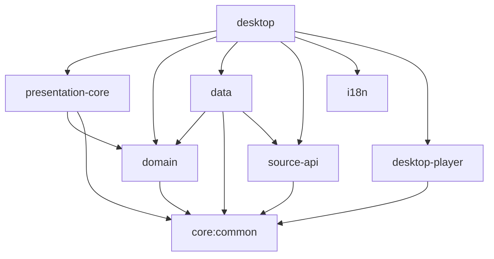

# Anikku Windows Port - Architecture Documentation

## Overview

This document describes the architectural decisions and structure for the Anikku Windows port using Kotlin Multiplatform and Compose Desktop.

---

## Architecture Layers

The Windows port follows the same clean architecture principles as the Android app:

```
┌─────────────────────────────────────────────┐
│         Presentation Layer (UI)              │
│  - Compose Desktop Screens                   │
│  - ViewModels & State Management             │
│  - Navigation (Voyager)                      │
└──────────────┬──────────────────────────────┘
               │
┌──────────────▼──────────────────────────────┐
│           Domain Layer                       │
│  - Use Cases (Interactors)                   │
│  - Repository Interfaces                     │
│  - Domain Models                             │
│  - Business Logic                            │
└──────────────┬──────────────────────────────┘
               │
┌──────────────▼──────────────────────────────┐
│           Data Layer                         │
│  - Repository Implementations                │
│  - Data Sources (Local, Remote, Cache)       │
│  - SQLDelight Database                       │
│  - Network (Ktor Client)                     │
└──────────────┬──────────────────────────────┘
               │
┌──────────────▼──────────────────────────────┐
│         Platform Layer                       │
│  - Windows-specific Implementations          │
│  - File System (java.nio.file)               │
│  - Video Player (VLCJ)                       │
│  - Notifications (Windows Toast)             │
│  - System Integration (JNA)                  │
└─────────────────────────────────────────────┘
```

---

## Kotlin Multiplatform Structure

### Source Sets

Each module that needs platform-specific code uses the following structure:

```
module/
├── src/
│   ├── commonMain/          # Shared code (Android + Desktop)
│   │   └── kotlin/
│   ├── androidMain/         # Android-specific
│   │   └── kotlin/
│   └── desktopMain/         # Desktop-specific (Windows, Linux, macOS)
│       └── kotlin/
└── build.gradle.kts
```

### Platform Abstraction Pattern

We use Kotlin's `expect`/`actual` mechanism for platform-specific implementations:

```kotlin
// commonMain/kotlin/Platform.kt
expect class PlatformContext

expect fun getPlatformName(): String

expect class FileManager {
    fun getAppDataDir(): Path
    fun getCacheDir(): Path
    fun getDownloadsDir(): Path
}

// desktopMain/kotlin/Platform.kt
actual class PlatformContext

actual fun getPlatformName(): String = "${System.getProperty("os.name")} Desktop"

actual class FileManager {
    actual fun getAppDataDir(): Path {
        val appData = System.getenv("APPDATA") ?: System.getProperty("user.home")
        return Paths.get(appData, "Anikku")
    }
    
    actual fun getCacheDir(): Path {
        val localAppData = System.getenv("LOCALAPPDATA") ?: System.getProperty("user.home")
        return Paths.get(localAppData, "Anikku", "cache")
    }
    
    actual fun getDownloadsDir(): Path {
        val userHome = System.getProperty("user.home")
        return Paths.get(userHome, "Downloads", "Anikku")
    }
}
```

---

## Module Migration Strategy

### Phase 1: Foundation (Session 1-2)
- ✅ Desktop module creation
- ⏳ Core/Common → KMP
- ⏳ Platform abstractions
- ⏳ Build system configuration

### Phase 2: Business Logic (Session 3-4)
- Domain layer → KMP
- Data layer → KMP
- SQLDelight desktop driver
- File system abstractions

### Phase 3: Features (Session 5-10)
- Source API & extensions
- Video player integration
- UI screens migration
- Download manager
- Tracking services

### Phase 4: Polish (Session 11-12)
- Windows integration
- Installer & packaging
- Testing & optimization
- Documentation

---

## Module Dependencies



---

## Platform-Specific Implementations

### 1. File System

**Challenge**: Replace Android's Storage Access Framework

**Solution**: Use `java.nio.file` with Windows-specific paths

```kotlin
// Desktop file paths
Windows:
- Config:     %APPDATA%\Anikku\config\
- Database:   %APPDATA%\Anikku\anikku.db
- Cache:      %LOCALAPPDATA%\Anikku\cache\
- Downloads:  %USERPROFILE%\Downloads\Anikku\
- Logs:       %LOCALAPPDATA%\Anikku\logs\

Linux:
- Config:     ~/.config/anikku/
- Database:   ~/.local/share/anikku/anikku.db
- Cache:      ~/.cache/anikku/
- Downloads:  ~/Downloads/Anikku/

macOS:
- Config:     ~/Library/Application Support/Anikku/
- Database:   ~/Library/Application Support/Anikku/anikku.db
- Cache:      ~/Library/Caches/Anikku/
- Downloads:  ~/Downloads/Anikku/
```

### 2. Video Player

**Challenge**: Replace mpv-android

**Solution**: VLCJ (VLC bindings for Java)

```kotlin
interface VideoPlayer {
    fun load(url: String)
    fun play()
    fun pause()
    fun stop()
    fun seek(position: Long)
    fun setVolume(volume: Int)
    fun setSubtitleTrack(track: Int)
    fun setAudioTrack(track: Int)
}

class VLCJPlayer : VideoPlayer {
    private val factory = MediaPlayerFactory()
    private val player = factory.mediaPlayers().newEmbeddedMediaPlayer()
    
    override fun load(url: String) {
        player.media().play(url)
    }
    // ... implementations
}
```

### 3. Database

**Challenge**: Use SQLDelight with desktop driver

**Solution**: JDBC SQLite driver

```kotlin
// Desktop database initialization
object DatabaseFactory {
    fun create(context: PlatformContext): Database {
        val driver = JdbcSqliteDriver(
            url = "jdbc:sqlite:${getAppDataDir()}/anikku.db",
            schema = Database.Schema
        )
        return Database(driver)
    }
}
```

### 4. HTTP Client

**Challenge**: OkHttp is Android-focused

**Solution**: Ktor Client (multiplatform)

```kotlin
// Desktop HTTP client
val httpClient = HttpClient(CIO) {
    install(ContentNegotiation) {
        json(Json {
            ignoreUnknownKeys = true
            prettyPrint = true
        })
    }
    install(Logging) {
        logger = Logger.DEFAULT
        level = LogLevel.INFO
    }
    engine {
        requestTimeout = 30_000
    }
}
```

### 5. Notifications

**Challenge**: Android NotificationManager doesn't exist on desktop

**Solution**: Windows Toast Notifications via PowerShell/JNA

```kotlin
class WindowsNotificationManager {
    fun showToast(title: String, message: String, imageUrl: String? = null) {
        val ps = PowerShell.openSession()
        val script = """
            [Windows.UI.Notifications.ToastNotificationManager, Windows.UI.Notifications, ContentType = WindowsRuntime] | Out-Null
            [Windows.Data.Xml.Dom.XmlDocument, Windows.Data.Xml.Dom.XmlDocument, ContentType = WindowsRuntime] | Out-Null
            
            $$template = @"
            <toast>
                <visual>
                    <binding template="ToastGeneric">
                        <text>$title</text>
                        <text>$message</text>
                    </binding>
                </visual>
            </toast>
            "@
            
            $$xml = New-Object Windows.Data.Xml.Dom.XmlDocument
            $$xml.LoadXml($$template)
            
            $$toast = New-Object Windows.UI.Notifications.ToastNotification $$xml
            [Windows.UI.Notifications.ToastNotificationManager]::CreateToastNotifier("Anikku").Show($$toast)
        """.trimIndent()
        
        ps.executeCommand(script)
        ps.close()
    }
}
```

### 6. Extensions Loading

**Challenge**: Can't use APK loading on desktop

**Solution**: JAR class loading

```kotlin
class DesktopExtensionLoader {
    private val extensionsDir = File(getAppDataDir(), "extensions")
    
    fun loadExtensions(): List<AnimeSource> {
        val sources = mutableListOf<AnimeSource>()
        
        extensionsDir.listFiles { file -> file.extension == "jar" }?.forEach { jarFile ->
            val classLoader = URLClassLoader(
                arrayOf(jarFile.toURI().toURL()),
                this::class.java.classLoader
            )
            
            // Use ServiceLoader to discover implementations
            val loader = ServiceLoader.load(AnimeSource::class.java, classLoader)
            sources.addAll(loader)
        }
        
        return sources
    }
}
```

### 7. Background Tasks

**Challenge**: No WorkManager on desktop

**Solution**: Coroutines with custom task scheduler

```kotlin
class DesktopTaskScheduler {
    private val scope = CoroutineScope(Dispatchers.Default + SupervisorJob())
    
    fun schedulePeriodicTask(
        name: String,
        interval: Duration,
        task: suspend () -> Unit
    ): Job {
        return scope.launch {
            while (isActive) {
                try {
                    task()
                } catch (e: Exception) {
                    logger.error("Task $name failed", e)
                }
                delay(interval)
            }
        }
    }
}
```

---

## UI Architecture

### Navigation

Using **Voyager** (already KMP-compatible):

```kotlin
@Composable
fun DesktopApp() {
    Navigator(HomeScreen()) { navigator ->
        // Desktop-specific scaffold
        DesktopScaffold(navigator) {
            CurrentScreen()
        }
    }
}
```

### Screen Structure

```kotlin
sealed class Screen : cafe.adriel.voyager.core.screen.Screen {
    @Composable
    override fun Content() {
        // Screen content
    }
    
    data object Library : Screen()
    data object Browse : Screen()
    data object Updates : Screen()
    data object History : Screen()
    data class AnimeDetail(val animeId: Long) : Screen()
    data class Player(val episodeId: Long) : Screen()
}
```

### Desktop-Specific UI Patterns

1. **Menu Bar**: Native menu bar for File, Edit, View, Help
2. **Context Menus**: Right-click menus for list items
3. **Keyboard Shortcuts**: Ctrl+O (Open), Ctrl+S (Settings), etc.
4. **Multi-window Support**: Separate player window, settings window
5. **System Tray**: Minimize to tray with quick actions

---

## Dependency Injection

### Migrating from Injekt to Koin

**Android (Current)**:
```kotlin
object Injekt.get<AnimeRepository>()
```

**Desktop (New)**:
```kotlin
// Module definition
val domainModule = module {
    single<AnimeRepository> { AnimeRepositoryImpl(get()) }
    single<GetAnimeUseCase> { GetAnimeUseCase(get()) }
}

// Usage
@Composable
fun MyScreen() {
    val viewModel: MyViewModel = koinViewModel()
}
```

---

## Testing Strategy

### Unit Tests (Common)
```kotlin
// commonTest/kotlin/
class AnimeRepositoryTest {
    @Test
    fun `should fetch anime from remote`() = runTest {
        // Test implementation
    }
}
```

### Platform-Specific Tests
```kotlin
// desktopTest/kotlin/
class VLCJPlayerTest {
    @Test
    fun `should initialize VLCJ player`() {
        val player = VLCJPlayer()
        assertTrue(player.isReady())
    }
}
```

### Integration Tests
```kotlin
// Desktop integration tests
class DesktopIntegrationTest {
    @Test
    fun `should open and display video`() = runComposeUiTest {
        setContent {
            PlayerScreen(episodeId = 1L)
        }
        
        onNodeWithText("Play").performClick()
        onNodeWithTag("VideoPlayer").assertExists()
    }
}
```

---

## Performance Considerations

### Memory Management
- Use `remember` for Compose state
- Properly dispose VLCJ player when screen closes
- Cache images with Coil
- Limit database query results with pagination

### Threading
- UI updates on `Dispatchers.Main.immediate`
- Database operations on `Dispatchers.IO`
- Video decoding on native thread (VLCJ handles this)
- Network requests on `Dispatchers.IO`

### Startup Time
- Lazy initialization of heavy components
- Load extensions asynchronously
- Defer non-critical initialization

---

## Security Considerations

### Extension Sandboxing
- Load extensions in isolated classloaders
- Consider SecurityManager for extension restrictions
- Validate extension signatures (future enhancement)

### Network Security
- Use HTTPS for all API calls
- Certificate pinning for known services
- No plaintext password storage (use OS keychain)

### File System
- Validate user-provided file paths
- Sandbox extension file access
- Use temp directory for untrusted files

---

## Packaging & Distribution

### Build Process
```bash
# Build desktop application
./gradlew :desktop:packageDistributionForCurrentOS

# Create Windows MSI installer
./gradlew :desktop:packageMsi

# Create portable ZIP
./gradlew :desktop:createDistributable
```

### Installer Contents
- Anikku application (JAR + launcher)
- Bundled JRE (Java 17+)
- VLC runtime libraries
- Desktop shortcuts
- File associations (.mkv, .mp4, etc.)
- Uninstaller

### Update Mechanism
1. Check GitHub releases API on startup
2. Download new MSI if available
3. Prompt user to install
4. Silent update in background (optional)

---

## Future Enhancements

### Cross-Platform Support
- Linux support (already possible with Compose Desktop)
- macOS support (requires testing)
- Wayland support for Linux

### Features
- Multiple instance support (watch multiple anime)
- Advanced video filters (shaders)
- Chromecast/DLNA streaming
- Cloud sync (save progress to cloud)
- Theme customization (custom themes)

### Performance
- Hardware video decoding optimization
- Reduce memory footprint
- Faster startup time
- Better caching strategies

---

## Development Guidelines

### Code Style
- Follow Kotlin coding conventions
- Use meaningful variable names
- Document public APIs
- Write tests for critical logic

### Git Workflow
- Feature branches for major changes
- Keep Android app working during migration
- Tag sessions in commit messages: `[Session N]`
- Review changes before merging

### Session Handoff
- Document progress in migration plan
- Update this architecture doc with decisions
- Leave TODO comments for future sessions
- Create GitHub issues for blockers

---

## Resources

### Documentation
- [Compose Multiplatform](https://www.jetbrains.com/lp/compose-multiplatform/)
- [VLCJ](https://github.com/caprica/vlcj)
- [SQLDelight](https://cashapp.github.io/sqldelight/)
- [Koin](https://insert-koin.io/)
- [Ktor](https://ktor.io/)

### Sample Code
- `desktop/src/main/kotlin/` - Main application
- `core/common/src/desktopMain/` - Platform implementations
- `docs/` - Documentation

---

*Version*: 1.0  
*Last Updated*: Session 1  
*Next Review*: Session 3 (after domain migration)
